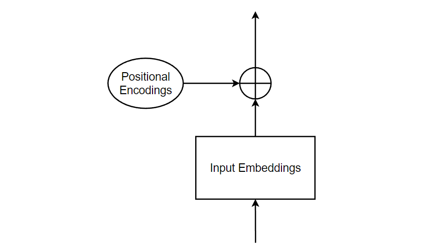

**Introduction**

Let's study "Attention is all you need" paper from scratch.

This paper introduced the concept of Transformer model architecture, which has become a foundational model in NLP tasks. The most fundamental concept in transformer architecture is the**_ self-attention _**mechanism. On surface level, **_self-attention_** is just another sequence-to-sequence operation i.e. It takes sequence as input and return sequence as output. But it is really powerful because of its ability to perform parallel computation and preserve long-term dependencies.

  <i><b>Fig: Transformer Architecture</b></i>

 

The above image shows transformer architecture with encoder and decoder. The original paper was introduced for neural machine translation task.

Now, Let’s try to understand the Transformer.

**Word Encoding/Representation**

At first, each input word is represented/encoded into some vectors. All the encoded vectors are of the same shape. And since the transformer model takes a fixed length sequence as input, the smaller length sequence is increased to that fixed length by padding empty strings just like in the diagram below.

  <i><b>Fig: Word Representation</b></i>

 

**Word Embedding**

Computers are unable to understand words. So, we need to represent the words as dense, low–dimensional vectors in a continuous vector space. The main idea of word embeddings is to capture the semantic and syntactic relationship between words. The embeddings are learned from large amounts of text data using unsupervised machine learning techniques. For Example : We take a paragraph, mask some portion of that paragraph, force the model to predict the masked part and repeat it multiple times. As a side effect of this, we are able to capture meaning and relationship between words by representing the word as an embedding vector. 

**Input Embedding**

Now, we pass our word representations to the word embeddings in a feed forward layer and obtain the embeddings for our input. The dimension of embeddings is described to be 512 in the original paper.

  <i><b>Fig: Input Embedding</b></i>

 

Now, we have generated input embeddings. Next step is to add the input embeddings with positional encodings.

**Positional Encodings**

Since we're dealing with natural language, the positions and order of the words are extremely important as sentences follow grammatical rules and different order of the same words can give different meanings. In transformer models, each word in a sentence flows through the encoder/decoder stack simultaneously and the model itself doesn't have any sense of position/order for each word. Therefore, there's a need to incorporate the order of the words into the model.

But in the vanilla Transformers, we use positional encodings.

Even if both the positional embeddings and positional encodings are for the same purpose, we need to understand that positional encodings are derived using some equations while positional embeddings are learned.

Positional embeddings are used as a query for masked prediction, while positional encodings are added before the first MHSA block model.

Equations to derive positional encodings for vanilla transformers are:

Now, after we’ve calculated the positional encoding, it’s time to add it with the input embeddings to preserve the position of words.

